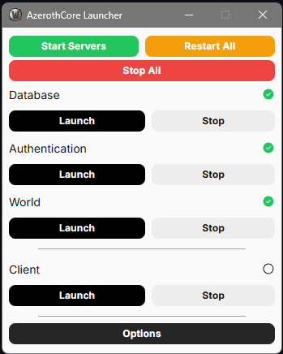

  
  
  # AzerothCore Launcher
  
  ### 🚀 Desktop launcher for AzerothCore WoW private servers
  
  Easy one-click management of database, authentication, and world server components with a beautiful GUI
  
  

## What is this application?

The AzerothCore Launcher is a helpful tool that makes it easy to manage your local World of Warcraft server. It provides a simple interface to control various server components without needing to use complex commands or understand technical details.

## Features

- Easy start/stop controls for server components
- User-friendly interface
- All-in-one control panel for your server/client

## How to Use

1. **Download and Install**
   - Download the latest version from the releases page
   - Install the application by running the installer
   - Launch the application from your desktop or start menu

2. **Getting Started**
   - When you first open the launcher, it will guide you through the initial setup
   - Follow the on-screen instructions to configure your server settings
   - Once setup is complete, you're ready to start managing your server!

3. **Managing Your Server**
   - Use the simple buttons to start or stop different server components
   - Monitor the status of your server directly from the launcher
   - Access basic server controls without needing to use command lines

## Need Help?

- Open an issue on GitHub if you find a bug

## Windows Defender SmartScreen Warning

When installing the application, you may see a warning from Windows Defender SmartScreen saying "Windows protected your PC" or "Unknown publisher". 

**The application is digitally signed with a self-signed certificate for security, but Windows may still show warnings for applications not signed with expensive commercial certificates.**

**The application is safe to install. To proceed:**
1. Click "More info" on the warning dialog
2. Click "Run anyway" 
3. The application will install normally

### Why do I see this warning?

- The application is code-signed with a self-signed certificate (which provides integrity verification)
- Commercial code-signing certificates cost $300+ per year, which isn't practical for free open-source projects
- Windows prioritizes applications signed with expensive commercial certificates from Certificate Authorities
- The application is open-source and you can review all code on GitHub for complete transparency

## About AzerothCore

This launcher is designed to work with AzerothCore, an open-source World of Warcraft server emulator. For more information about AzerothCore, visit [their official website](http://www.azerothcore.org/).

---
*Note: This launcher is a community tool and is not affiliated with or endorsed by Blizzard Entertainment.*
